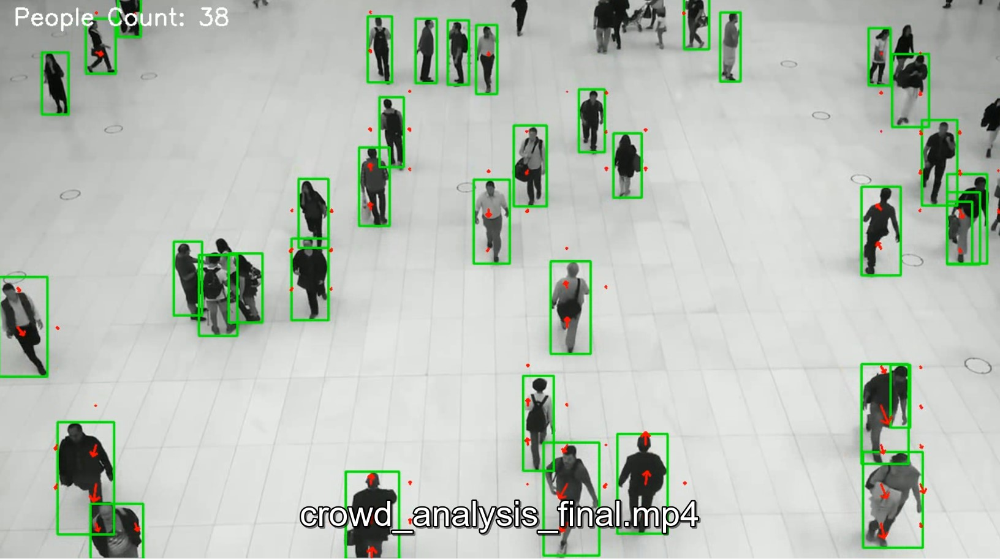
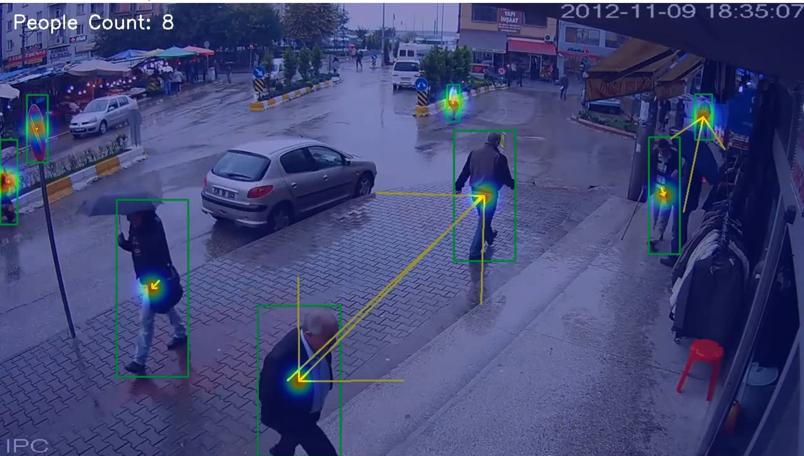

# Crowd Flow, Density & Counting System 🚶‍♂️🚶‍♀️

An AI-based crowd analysis system that detects people, counts them, estimates crowd
density, and analyzes region-wise crowd movement from surveillance videos using
deep learning and computer vision.

---

## 🔍 Problem Statement
Monitoring crowd behavior manually in public places such as streets, campuses,
stations, and events is inefficient and error-prone. Authorities require automated
systems to understand crowd size, density, and movement direction in real time
to ensure safety and prevent congestion or incidents.

This project provides an AI-based solution for intelligent crowd analysis using
video surveillance footage.

---

## 🚀 Features
- Real-time people detection using YOLOv8
- Crowd counting per video frame
- Region-wise crowd density estimation (heatmap)
- Optical flow–based crowd movement analysis
- Stable and meaningful crowd flow visualization
- Works with CCTV and fixed-camera videos

---

## 🧠 Methodology
1. **People Detection**
   - YOLOv8 detects individuals in each frame.
2. **Crowd Counting**
   - Number of detected persons per frame is calculated.
3. **Density Estimation**
   - Spatial distribution of people is visualized using heatmaps.
4. **Crowd Flow Analysis**
   - Optical flow estimates motion between frames.
   - Motion is masked using detected people regions.
   - Region-wise average motion vectors represent dominant crowd movement.

This approach avoids unreliable individual tracking in dense crowds and focuses
on collective behavior analysis.

---

## 🛠️ Tech Stack
- Python
- YOLOv8 (Ultralytics)
- OpenCV
- NumPy
- Optical Flow (Farneback)

---

## ▶️ How to Run

```bash
pip install -r requirements.txt
python crowd_analysis.py
```

## 📸 Demo

<p align="center">
  
</p>

<p align="center">
  
</p>
